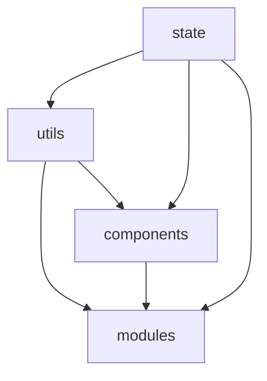
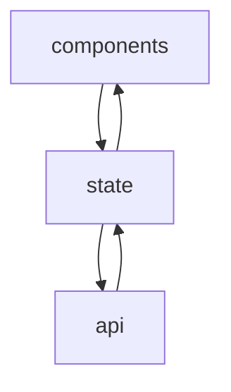

# Martrix Portal

Projet permettant de gérer des serveurs matrix. On aura la possibilité d'acheter, gérer des containeurs de serveur matrix HS, IS (mxisd). 

## Prérequis

Cette documentation peu être directement consultable dans un navigateur classique en installant le plugin 'Markdown Viewer' et autoriser l'accès aux url de fichier.

## Structure de la documentation

* [`utils`](utils/index.md)
* [`components`](components/index.md)
* [`modules`](modules/index.md)
* [`state`](state/index.md)
* [`api`](api/index.md)

## Dependance des modules

## Comunication composants

